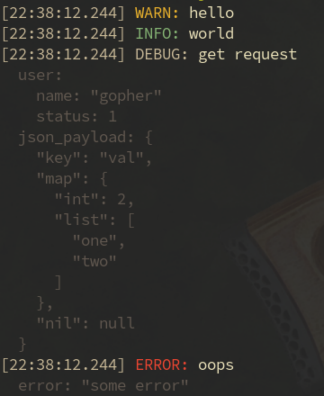

# Conslog

**Conslog** is a high-performance, structured logging package for Go, built as
a customizable extension of Go's standard [`slog`](https://pkg.go.dev/log/slog) package.
It provides flexible output modes including colorized, pretty-printed console logs
and JSON structured logs, optimized for both development and production environments.



- **Colorized Console Output**  
  Human-friendly, colorized logs with ANSI escape codes for easy reading
  during development. Supports pretty-printed JSON for complex values and
  nested attribute groups with indentation.

- **Thread-Safe Logging**  
  Uses mutex locking to ensure safe concurrent writes to output streams.

- **Efficient Resource Management**  
  Utilizes pooled buffers and JSON encoders to minimize memory allocations
  and maximize performance.

## Benchmarks

```text
cpu: Intel(R) Core(TM) i5-8250U CPU @ 1.60GHz
BenchmarkLoggingJSON/LargeMap-4             3896  312151 ns/op  14097 B/op  210 allocs/op
BenchmarkLoggingJSON/LargeMap-4             3463  309198 ns/op  14079 B/op  210 allocs/op
BenchmarkLoggingText/LargeMap-4             2606  420866 ns/op  11796 B/op  205 allocs/op
BenchmarkLoggingText/LargeMap-4             2734  421919 ns/op  11828 B/op  205 allocs/op
BenchmarkLoggingConsole/LargeMap-4          2356  486875 ns/op  29116 B/op  236 allocs/op
BenchmarkLoggingConsole/LargeMap-4          2395  487485 ns/op  29461 B/op  237 allocs/op
BenchmarkLoggingJSON/SingleKeyValue-4     127958    9170 ns/op    522 B/op    0 allocs/op
BenchmarkLoggingJSON/SingleKeyValue-4     130000    9090 ns/op    525 B/op    1 allocs/op
BenchmarkLoggingText/SingleKeyValue-4     126709    9261 ns/op    524 B/op    1 allocs/op
BenchmarkLoggingText/SingleKeyValue-4     128955    9213 ns/op    524 B/op    1 allocs/op
BenchmarkLoggingConsole/SingleKeyValue-4  115184   10089 ns/op    192 B/op    4 allocs/op
BenchmarkLoggingConsole/SingleKeyValue-4  117764   10069 ns/op    192 B/op    4 allocs/op
```

## Installation

Use Go modules to install:

```bash
go get github.com/voler88/conslog
```

## Usage

Below is a simple example demonstrating how to create and use a console logger
with `conslog`:

```go
package main

import (
    "os"

    "github.com/voler88/conslog"
    "log/slog"
)

func main() {
    // Create a new ConsoleHandler that writes to stdout with default options.
    handler := conslog.NewConsoleHandler(os.Stdout, nil)

    // Create a new slog.Logger using the ConsoleHandler.
    logger := slog.New(handler)

    // Log messages with various levels and structured attributes.
    logger.Info("Server started", slog.String("port", "8080"))
    logger.Debug("Debugging enabled", slog.String("config", "dev"))
    logger.Warn("Cache miss", slog.Int("items", 5))
    logger.Error("Failed to connect", slog.String("db", "users"))
}
```

Also you can use [pkg/logging](pkg/logging) Logger interface for easy integration.

## Testing

Run unit tests and benchmarks with:

```bash
make test
make bench
```

## Contributing

Contributions, issues, and feature requests are welcome! Please open an issue
or submit a pull request.

## License

This project is licensed under the [MIT License](LICENSE).
