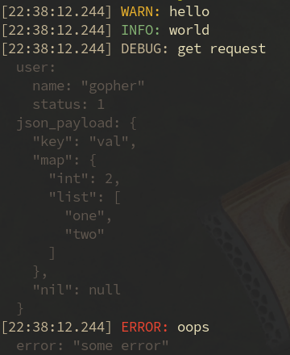

# Logging with Go's slog

This Go package provides a customizable logger based on Go's standard
[`slog`](https://pkg.go.dev/log/slog) package. It supports two output modes:

- **JSON Output:** Uses the built-in `slog.JSONHandler` for structured log output.
- **Console Output:** Uses a colorized, pretty-printed output via a custom `ConsoleHandler`.
  Ideal for human-friendly logging during development.

## Features

- **Log Levels:**  
  Controls verbosity using log levels in each logger (ERROR, WARN, INFO, DEBUG).
  You can configure the logger's verbosity by setting a level counter.
  
- **Custom Handlers:**  
  Depending on the provided handler type (`"default"` or `"console"`),
  the logger either outputs JSON or pretty, colored log messages.
  
- **Structured Logging:**  
  Support for structured key/value logging that can be extended with
  additional context or grouped attributes.
  
- **Colorized Console Output:**  
  The `ConsoleHandler` formats time, level, and messages with ANSI color codes.
  Attributes and groups are printed with an appropriate indentation level,
  their contents prints as pretty JSON.

## ConsoleHandler screenshot



## Installation

To use this package in your project, simply install it using Go modules. For example:

```bash
go get github.com/voler88/logging
```

## Usage

Below is a basic example of how to create and use the logger:

```go
package main

import (
    "os"

    "github.com/voler88/logging"
)

func main() {
    // Create a new logger that writes to stdout.
    // Use "default" for JSON logging or "console" for pretty console output.
    logger := logging.New(os.Stdout, "console")

    // Set the desired verbosity level (0=ERROR, 1=WARN, 2=INFO, 3 or higher=DEBUG).
    if err := logger.SetLevel(logging.LevelDebug); err != nil {
        panic(err)
    }

    // Log messages at various levels.
    logger.Error("An error occurred", "code", 123)
    logger.Warn("This is a warning", "file", "server.go")
    logger.Info("Server started", "port", 8080)
    logger.Debug("Debug info", "config", map[string]string{"env": "dev"})
}
```

## Testing

Unit tests are provided in the package and can be run using:

```bash
go test ./...
go test -bench=. ./...
```

Tests cover:

- Handler selection and output format.
- Log level filtering via `SetLevel`.
- Benchmark for default (JSON) and Console handlers.

## Contributing

Feel free to open issues or pull requests if you have improvements or bug fixes.

## License

This project is licensed under the [MIT License](LICENSE).
